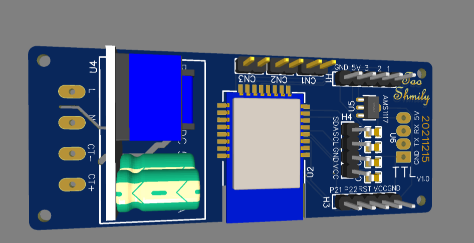
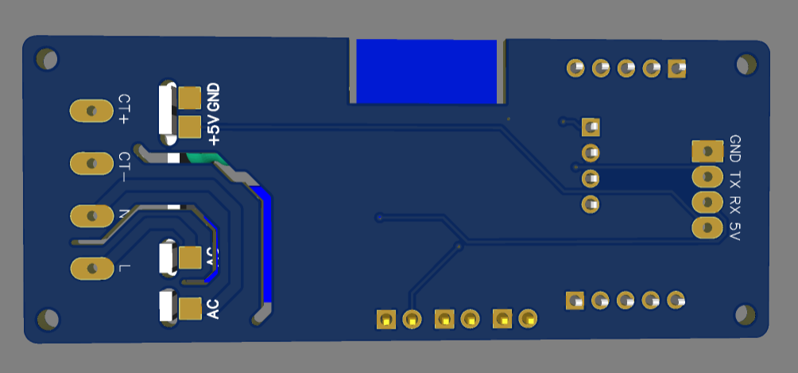
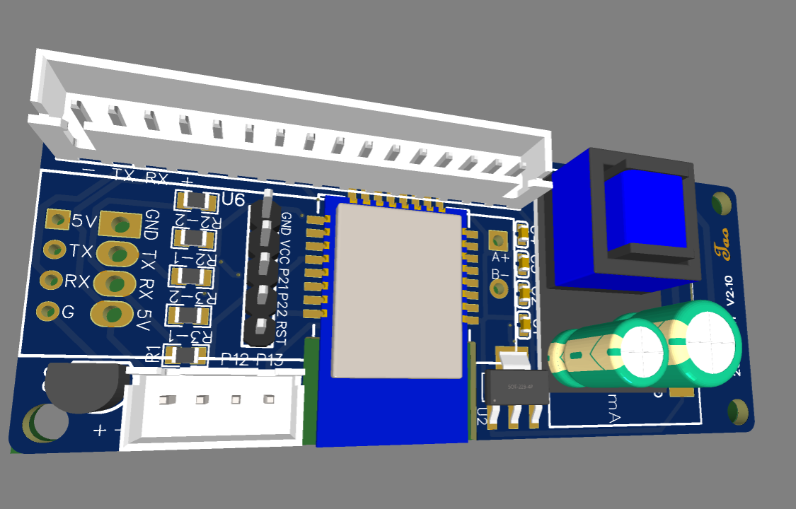
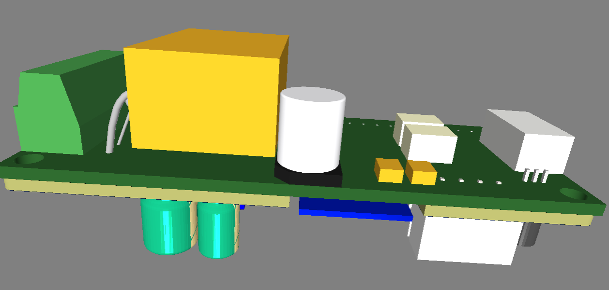
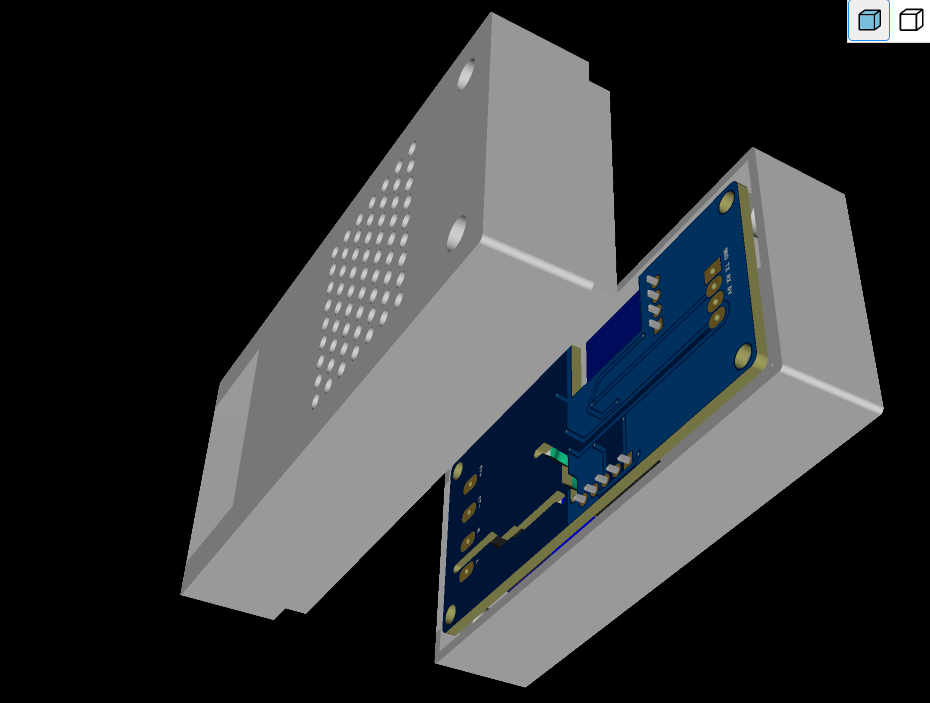
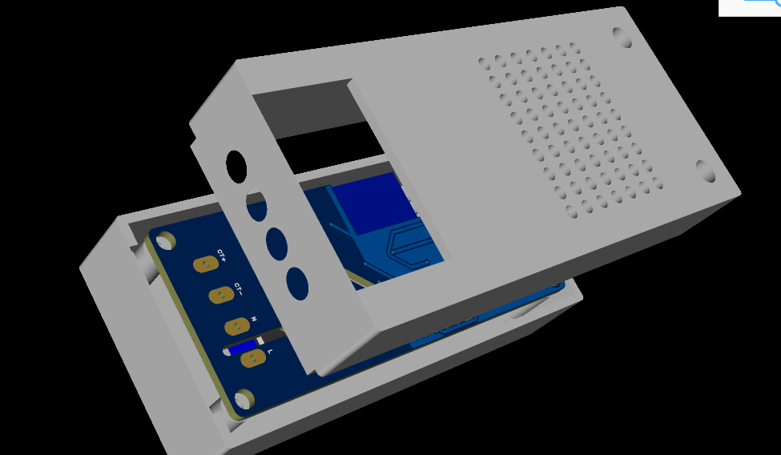

# 培正电表使用zigbee协议接入z2m

使用E18-MS1和ESP12F的双模块接入电路。智能家居从WiFi协议迁移到ZB。

## To Do List

* [X] 三路光耦隔离继电器设计。
* [X] 电路验证。
* [X] 双芯片固件设计。（第一版没有加入通用PCB）
* [ ] 墨水屏支持。
* [X] ESP和ZB双芯片控制板设计。温湿度模块使用shtc3/bme280。
* [X] 外壳3D打印文件设计。
* [X] 多路培正模块连接电路。
* [X] 空开自动上电电路。
#### 主控模块：

E18-MS1	BMP280更换为ds18b20减小传感器体积。

#### 3D外壳

#### 继电器模块：

三路继电器，都是按照光耦隔离原理图画的，受限于主板尺寸，高压侧沟槽有两路没有开，没有物理隔离，控制220V不安全，relay1开了沟槽，可以控制220V，电路未验证！后果自负。

